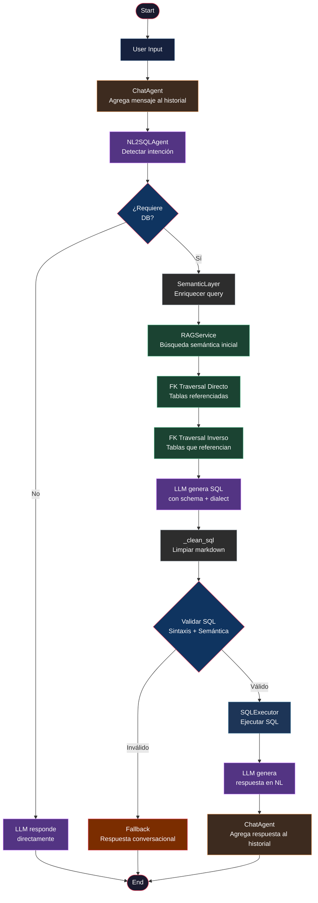

# NL2SQL Flowchart

```mermaid
flowchart TD
    A([Start]):::terminal --> B[User Input]:::input
    B --> C[ChatAgent\nAgrega mensaje al historial]:::agent

    C --> D[NL2SQLAgent\nDetectar intención]:::llm
    D --> E{¿Requiere\nDB?}:::decision

    E -->|No| F[LLM responde\ndirectamente]:::llm
    F --> G([End]):::terminal

    E -->|Sí| H[SemanticLayer\nEnriquecer query]:::service
    H --> I[RAGService\nBúsqueda semántica inicial]:::rag
    I --> J[FK Traversal Directo\nTablas referenciadas]:::rag
    J --> K[FK Traversal Inverso\nTablas que referencian]:::rag
    K --> L[LLM genera SQL\ncon schema + dialect]:::llm
    L --> M[_clean_sql\nLimpiar markdown]:::service
    M --> N{Validar SQL\nSintaxis + Semántica}:::decision

    N -->|Inválido| O[Fallback\nRespuesta conversacional]:::error
    O --> G

    N -->|Válido| P[SQLExecutor\nEjecutar SQL]:::db
    P --> Q[LLM genera\nrespuesta en NL]:::llm
    Q --> R[ChatAgent\nAgrega respuesta al historial]:::agent
    R --> G

    classDef terminal fill:#1a1a2e,stroke:#e94560,color:#fff
    classDef input fill:#16213e,stroke:#0f3460,color:#fff
    classDef decision fill:#0f3460,stroke:#e94560,color:#fff
    classDef llm fill:#533483,stroke:#c77dff,color:#fff
    classDef rag fill:#1b4332,stroke:#52b788,color:#fff
    classDef db fill:#1d3557,stroke:#457b9d,color:#fff
    classDef service fill:#2d2d2d,stroke:#adb5bd,color:#fff
    classDef agent fill:#3d2b1f,stroke:#f4a261,color:#fff
    classDef error fill:#7b2d00,stroke:#e94560,color:#fff
```
