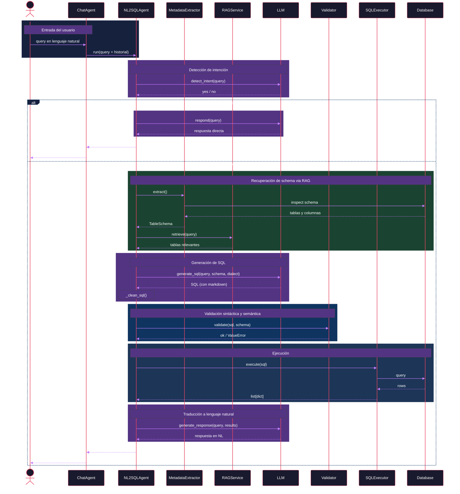

# NL2SQL Sequence Diagram

```mermaid
%%{init: {'theme': 'base', 'themeVariables': {
  'actorBkg': '#1a1a2e',
  'actorBorder': '#e94560',
  'actorTextColor': '#ffffff',
  'actorLineColor': '#e94560',
  'signalColor': '#c77dff',
  'signalTextColor': '#ffffff',
  'labelBoxBkgColor': '#16213e',
  'labelBoxBorderColor': '#0f3460',
  'labelTextColor': '#ffffff',
  'loopTextColor': '#ffffff',
  'noteBkgColor': '#533483',
  'noteTextColor': '#ffffff',
  'activationBkgColor': '#0f3460',
  'activationBorderColor': '#e94560',
  'sequenceNumberColor': '#ffffff'
}}}%%

sequenceDiagram
    actor User
    participant Chat as ChatAgent
    participant NL2SQL as NL2SQLAgent
    participant Meta as MetadataExtractor
    participant RAG as RAGService
    participant LLM
    participant Val as Validator
    participant Exec as SQLExecutor
    participant DB as Database

    rect rgb(22, 33, 62)
        Note over User,Chat: Entrada del usuario
        User->>Chat: query en lenguaje natural
        Chat->>NL2SQL: run(query + historial)
    end

    rect rgb(83, 52, 131)
        Note over NL2SQL,LLM: Detección de intención
        NL2SQL->>LLM: detect_intent(query)
        LLM-->>NL2SQL: yes / no
    end

    alt No requiere DB
        rect rgb(83, 52, 131)
            NL2SQL->>LLM: respond(query)
            LLM-->>NL2SQL: respuesta directa
        end
        NL2SQL-->>Chat: respuesta
        Chat-->>User: respuesta

    else Requiere DB
        rect rgb(27, 67, 50)
            Note over NL2SQL,DB: Recuperación de schema via RAG
            NL2SQL->>Meta: extract()
            Meta->>DB: inspect schema
            DB-->>Meta: tablas y columnas
            Meta-->>NL2SQL: TableSchema
            NL2SQL->>RAG: retrieve(query)
            RAG-->>NL2SQL: tablas relevantes
        end

        rect rgb(83, 52, 131)
            Note over NL2SQL,LLM: Generación de SQL
            NL2SQL->>LLM: generate_sql(query, schema, dialect)
            LLM-->>NL2SQL: SQL (con markdown)
            Note over NL2SQL: _clean_sql()
        end

        rect rgb(15, 52, 96)
            Note over NL2SQL,Val: Validación sintáctica y semántica
            NL2SQL->>Val: validate(sql, schema)
            Val-->>NL2SQL: ok / ValueError
        end

        rect rgb(29, 53, 87)
            Note over NL2SQL,DB: Ejecución
            NL2SQL->>Exec: execute(sql)
            Exec->>DB: query
            DB-->>Exec: rows
            Exec-->>NL2SQL: list[dict]
        end

        rect rgb(83, 52, 131)
            Note over NL2SQL,LLM: Traducción a lenguaje natural
            NL2SQL->>LLM: generate_response(query, results)
            LLM-->>NL2SQL: respuesta en NL
        end

        NL2SQL-->>Chat: respuesta
        Chat-->>User: respuesta
    end
```
